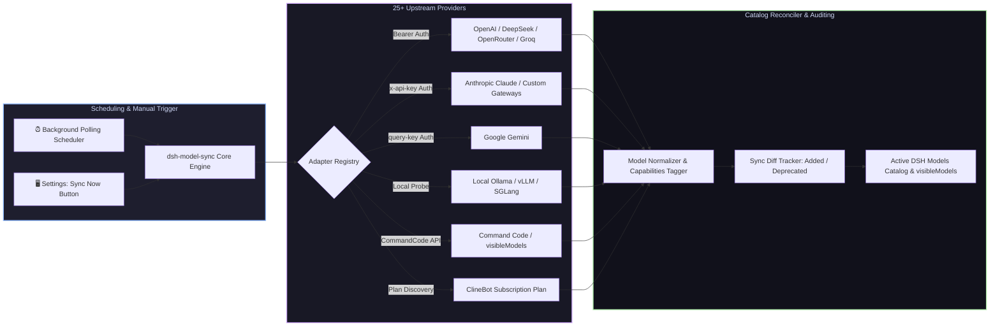

# 📦 @goodandready/dsh-model-sync

<div align="center">

<h3>Dynamic LLM Model Catalog Synchronization & Automated Balance Monitoring for DeepSeek Harness</h3>

<p align="center">
  <a href="https://www.npmjs.com/package/@goodandready/dsh-model-sync"></a>
  <a href="LICENSE"></a>
  <a href="https://github.com/topics/dsh-plugin"></a>
  <a href="https://nodejs.org"></a>
</p>

<p align="center">
  <a href="https://goodandready.app/"></a>
</p>

<p align="center">
  <a href="README.md"><b>🇬🇧 English</b></a> •
  <a href="README.ru.md"><b>🇷🇺 Русский</b></a> •
  <a href="README.zh.md"><b>🇨🇳 中文说明</b></a>
</p>

<table align="center">
  <tr>
    <td align="center">
      ⭐ <strong>If you like this plugin, please star it on GitHub</strong> — it shows me that the plugin is useful to you and motivates me to keep developing it.
      <br><br>
      🐛 <strong>If you find a bug or would like to request a feature</strong>, open a GitHub issue in any language — I will review your proposal and implement useful suggestions in a future plugin version.
    </td>
  </tr>
</table>

</div>

---

## ⚡ Overview

**`dsh-model-sync`** keeps your **DeepSeek Harness** model catalog up-to-date with upstream AI providers. 

Instead of manually editing YAML configs whenever a provider launches a new model, adjusts context window limits, or changes pricing, `dsh-model-sync` automatically discovers new releases, updates capability metadata (`vision`, `tools`, `reasoning`, `embeddings`), tracks account balances, manages model selection visibility, and reconciles models on the fly without server restarts.



---

## ✨ Key Features

* ⚡ **High-Performance Policy Filtering**: Fast-path evaluation in `filterModels` bypasses regular expressions and array filtering when no filtering policy is configured, guaranteeing zero-overhead discovery runs.
* 🔄 **One-Click In-App Updates**: Built-in update checker in Settings with automatic npm cache bypass on demand (`?fresh=1` / `Cache-Control: no-cache`), ensuring instantaneous discovery of new package releases.
* 🔄 **Automated Catalog Discovery**: Syncs model lists, aliases, context windows, and capability flags (`vision`, `tools`, `reasoning`, `embeddings`) across 25+ providers.
* 🛡️ **Minijinja Chat Template & Role Compatibility**: Automatically sets `compat.supportsDeveloperRole: false` for Groq open-source models (Qwen, Llama, Mistral, Gemma, DeepSeek) and DeepSeek API, preventing 400 `Unexpected message role` errors with reasoning models while preserving user overrides.
* 🌐 **25+ Built-in Provider Adapters**: Pre-configured discovery for OpenAI, Anthropic, Google, DeepSeek, xAI, OpenRouter, Groq, Mistral, Cerebras, Fireworks, HuggingFace, Moonshot, NVIDIA, Qwen, Together, Xiaomi MiMo, SiliconFlow, Command Code, ClineBot, and local Ollama.
* 🎛️ **Command Code Model Selection**: Full discovery of Command Code models with granular checkbox selection in the UI, automatically syncing `visibleModels` to `llm-commandcode` settings.
* 🎯 **ClineBot Subscription Plan Sync**: Dedicated adapter querying `GET /users/me/plan` to discover only active subscription-included models, eliminating catalog clutter from out-of-plan endpoints.
* 🔌 **Generic / Custom Adapter Support**: Connect arbitrary OpenAI-compatible `/v1/models` endpoints with configurable auth (`bearer`, `x-api-key`, `query-key`, `none`).
* 📊 **Balance & Quota Monitoring**: Queries upstream billing endpoints (where supported) to report account credit balances and prevent unexpected exhaustion.
* 📜 **Sync History & Diff Auditing**: Tracks all newly discovered models, deprecated IDs, and modified capabilities with timestamped diff logs in the Web UI.
* 🖥️ **Full Web GUI Panel (**Settings → Model Synchronization**)**:
  * Live status cards per provider with active model counters;
  * Instant "Sync Now" button for on-demand catalog refreshes;
  * Granular model checkboxes for selection and visibility management;
  * Provider enable/disable toggles and custom endpoint inputs.

---

## 🛠️ Supported Discovery Providers

| Provider Identifier | Authentication Format | Capabilities Auto-Detection & Notes |
|---|---|---|
| `openai` | Bearer Token | `vision`, `tools`, `reasoning`, `embeddings` |
| `anthropic` | `x-api-key` header | `vision`, `tools`, `reasoning` |
| `google` | Query parameter / Key | `vision`, `tools`, `reasoning`, `embeddings` |
| `deepseek` | Bearer Token | `tools`, `reasoning` |
| `xai` | Bearer Token | `vision`, `tools`, `reasoning` |
| `openrouter` | Bearer Token | Multi-vendor model catalog with pricing & context limits |
| `groq` | Bearer Token | `tools`, `reasoning`, `vision`, `supportsDeveloperRole: false` |
| `mistral` | Bearer Token | `tools`, `reasoning`, `vision` |
| `commandcode` | Bearer Token | `https://api.commandcode.ai/provider/v1/models` catalog with `visibleModels` selection syncing to `llm-commandcode` |
| `clinebot` | Bearer Token | Active subscription plan discovery (`/users/me/plan`), restricting sync strictly to plan-included models |
| `fireworks` | Bearer Token | Open-weights inference endpoints |
| `huggingface` | Bearer Token | Serverless Inference API catalog |
| `together` | Bearer Token | Open-source model catalog |
| `ollama` | Local HTTP (`none`) | Local offline model discovery (`/api/tags`) |
| `custom` | Configurable | Any custom OpenAI or Google compatible gateway |

---

## 📦 Quick Installation

```bash
dsh plugin --profile web add @goodandready/dsh-model-sync
```

> [!IMPORTANT]
> Restart DSH Web UI after installation (`systemctl --user restart dsh-web`) to activate background catalog synchronization.

---

## ⚙️ Configuration (`settings.yaml`)

```yaml
dsh-model-sync:
  enabled: true
  syncIntervalMinutes: 60
  autoReconcile: true
  enableBalanceChecks: true
  providers:
    commandcode:
      enabled: true
    clinebot:
      enabled: true
```

| Parameter | Type | Default | Description |
|---|---|---|---|
| `enabled` | `boolean` | `true` | Master switch for background synchronization |
| `syncIntervalMinutes` | `number` | `60` | Polling frequency for catalog refreshes |
| `autoReconcile` | `boolean` | `true` | Automatically apply discovered models to active catalog |
| `enableBalanceChecks` | `boolean` | `true` | Query billing endpoints where supported |
| `providers.<id>.enabled`| `boolean` | `true` | Enable or disable discovery for specific provider |

---

## 📄 License

MIT © [GooDAnDReaDY](https://github.com/GooDAnDReaDY)
