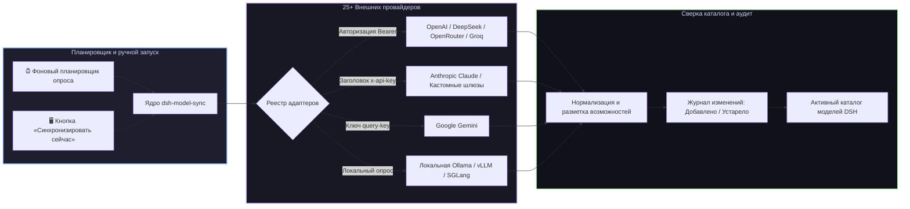

# 📦 @goodandready/dsh-model-sync

<div align="center">

<h3>Динамическая синхронизация каталогов моделей и автоматический мониторинг баланса для DeepSeek Harness</h3>

<p align="center">
  <a href="https://www.npmjs.com/package/@goodandready/dsh-model-sync"></a>
  <a href="LICENSE"></a>
  <a href="https://github.com/topics/dsh-plugin"></a>
  <a href="https://nodejs.org"></a>
</p>

<p align="center">
  <a href="https://goodandready.app/"></a>
</p>

<p align="center">
  <a href="README.md"><b>🇬🇧 English</b></a> •
  <a href="README.ru.md"><b>🇷🇺 Русский</b></a> •
  <a href="README.zh.md"><b>🇨🇳 中文说明</b></a>
</p>

</div>

---

## ⚡ Обзор

**`dsh-model-sync`** обеспечивает автоматическую актуализацию каталога моделей **DeepSeek Harness** напрямую от подключенных провайдеров.

Вместо ручного редактирования YAML-файлов при выходе новых моделей, смене лимитов контекста или цен, плагин автоматически обнаруживает релизы, обновляет флаги возможностей (`vision`, `tools`, `reasoning`, `embeddings`), отслеживает остатки баланса и обновляет каталог на лету без перезапуска сервера.



---

## ✨ Ключевые возможности

* 🔄 **Автоматическое обнаружение моделей**: синхронизация списков моделей, контекстных окон и возможностей (`vision`, `tools`, `reasoning`, `embeddings`) для 25+ провайдеров.
* 🌐 **25+ встроенных адаптеров**: готовая поддержка OpenAI, Anthropic, Google, DeepSeek, xAI, OpenRouter, Groq, Mistral, Cerebras, Fireworks, HuggingFace, Moonshot, NVIDIA, Qwen, Together, Xiaomi MiMo, SiliconFlow и локальной Ollama.
* 🔌 **Универсальные кастомные адаптеры**: подключение любых сторонних OpenAI-совместимых эндпоинтов `/v1/models` (`bearer`, `x-api-key`, `query-key`, `none`).
* 📊 **Мониторинг баланса и квот**: опрос биллинга провайдеров (где доступно) для контроля остатка кредитов.
* 📜 **Журнал изменений (Diff Log)**: фиксация добавленных, удаленных и обновленных моделей с отметками времени.
* 🖥️ **Панель управления в Web GUI (**Настройки → Синхронизация моделей**)**:
  * Статус-карточки со счетчиками активных моделей по каждому провайдеру;
  * Кнопка «Синхронизировать сейчас» для мгновенного обновления;
  * Переключатели провайдеров и ввод пользовательских адресов.

---

## 📦 Быстрая установка

```bash
dsh plugin --profile web add @goodandready/dsh-model-sync
```

---

## ⚙️ Пример конфигурации (`settings.yaml`)

```yaml
dsh-model-sync:
  enabled: true
  syncIntervalMinutes: 60
  autoReconcile: true
  providers:
    openrouter:
      enabled: true
      keyEnv: OPENROUTER_API_KEY
    deepseek:
      enabled: true
      keyEnv: DEEPSEEK_API_KEY
    custom:
      enabled: false
      baseURL: http://127.0.0.1:8000/v1
      authType: bearer
      keyEnv: CUSTOM_API_KEY
```

---

## 📄 Лицензия

MIT © [GooDAnDReaDY](https://github.com/GooDAnDReaDY)
