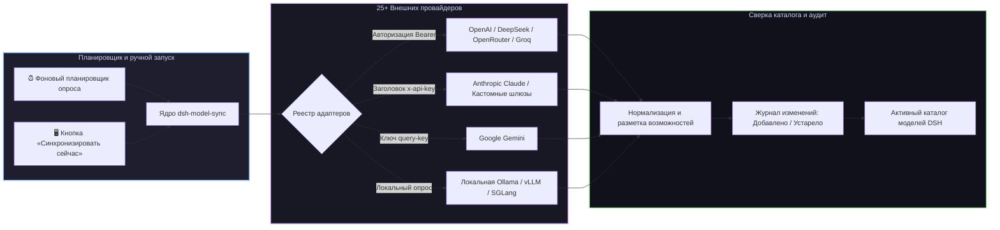

# 📦 @goodandready/dsh-model-sync

<div align="center">

<h3>Динамическая синхронизация каталогов моделей и автоматический мониторинг баланса для DeepSeek Harness</h3>

<p align="center">
  <a href="https://www.npmjs.com/package/@goodandready/dsh-model-sync"></a>
  <a href="LICENSE"></a>
  <a href="https://github.com/topics/dsh-plugin"></a>
  <a href="https://nodejs.org"></a>
</p>

<p align="center">
  <a href="https://goodandready.app/"></a>
</p>

<p align="center">
  <a href="README.md"><b>🇬🇧 English</b></a> •
  <a href="README.ru.md"><b>🇷🇺 Русский</b></a> •
  <a href="README.zh.md"><b>🇨🇳 中文说明</b></a>
</p>

<table align="center">
  <tr>
    <td align="center">
      ⭐ <strong>Если вам нравится этот плагин, поставьте ему звезду на GitHub</strong> — это покажет мне, что плагин вам полезен, и будет мотивировать меня развивать его дальше.
      <br><br>
      🐛 <strong>Если вы нашли баг или хотите предложить новый функционал</strong>, создайте issue на GitHub на любом языке — я рассмотрю ваше предложение и реализую полезные идеи в одной из следующих версий плагина.
    </td>
  </tr>
</table>

</div>

---

## ⚡ Обзор

**`dsh-model-sync`** обеспечивает автоматическую актуализацию каталога моделей **DeepSeek Harness** напрямую от подключенных провайдеров.

Вместо ручного редактирования YAML-файлов при выходе новых моделей, смене лимитов контекста или цен, плагин автоматически обнаруживает релизы, обновляет флаги возможностей (`vision`, `tools`, `reasoning`, `embeddings`), отслеживает остатки баланса и обновляет каталог на лету без перезапуска сервера.



---

## ✨ Ключевые возможности

* 🔄 **Автоматическое обнаружение моделей**: синхронизация списков моделей, контекстных окон и возможностей (`vision`, `tools`, `reasoning`, `embeddings`) для 25+ провайдеров.
* 🌐 **25+ встроенных адаптеров**: готовая поддержка OpenAI, Anthropic, Google, DeepSeek, xAI, OpenRouter, Groq, Mistral, Cerebras, Fireworks, HuggingFace, Moonshot, NVIDIA, Qwen, Together, Xiaomi MiMo, SiliconFlow и локальной Ollama.
* 🔌 **Универсальные кастомные адаптеры**: подключение любых сторонних OpenAI-совместимых эндпоинтов `/v1/models` (`bearer`, `x-api-key`, `query-key`, `none`).
* 📊 **Мониторинг баланса и квот**: опрос биллинга провайдеров (где доступно) для контроля остатка кредитов.
* 📜 **Журнал изменений (Diff Log)**: фиксация добавленных, удаленных и обновленных моделей с отметками времени.
* 🖥️ **Панель управления в Web GUI (**Настройки → Синхронизация моделей**)**:
  * Статус-карточки со счетчиками активных моделей по каждому провайдеру;
  * Кнопка «Синхронизировать сейчас» для мгновенного обновления;
  * Переключатели провайдеров и ввод пользовательских адресов.

---

## 📦 Быстрая установка

```bash
dsh plugin --profile web add @goodandready/dsh-model-sync
```

---

## 🚀 Улучшения в версии 0.4.0

- **One-Click обновление плагина из настроек**: В карточку настроек плагина добавлен блок обновления с проверкой актуальной версии в npm, цветовым бейджем статуса и кнопкой обновления в один клик.
- **Защита write-эндпоинтов по Loopback**: Все мутирующие HTTP-маршруты (`/apply`, `/policy`, `/clear-cache`, `/updater/update`) строго проверяют адрес источника (`127.0.0.1`, `::1`, `::ffff:127.0.0.1`) и заголовок Origin/Host для предотвращения несанкционированного доступа.
- **Полная поддержка темы DSH (0 rgba / 0 hex)**: Все стили интерфейса переведены на официальные токены дизайн-системы DSH (`--dsw-alias-*`), обеспечивая нативную интеграцию со светлой и тёмной темами оформления.
- **Модульная архитектура синхронизатора**: Монолитная логика синхронизации разделена на специализированные модули (`synchronizer-helpers.js`, `synchronizer-transfer.js`, `synchronizer-prober.js`), что упрощает поддержку и снижает размер основного файла ниже 600 строк.
- **Чистый дистрибутив пакета**: Исключены внутренние файлы планирования и отладки; размер сжатого npm-пакета составляет менее 70 KiB, все файлы укладываются в лимит 256 KiB.

## 🚀 Улучшения в v0.3.13

* ⚡ **ETag / 304 Not Modified для фонового опроса UI**:
  * Реализована генерация слабого ETag для маршрута `GET /dsh-model-sync/status`. При 15-секундном опросе UI возвращается пустой ответ `304 Not Modified`, исключающий холостую сериализацию JSON и сетевой оверхед.
* 🌐 **Условные запросы к API провайдеров (Upstream Conditional Requests)**:
  * Передача заголовков `If-None-Match` и `If-Modified-Since` в generic и declarative адаптерах. При ответе `304` от апстрим-провайдера мгновенно возвращается кэш без повторного парсинга моделей.
* 🎯 **Debounce поиска и useMemo в веб-интерфейсе**:
  * Добавлен debounce (150 мс) на ввод в строку поиска и мемоизация `React.useMemo` для фильтрации и сортировки моделей в пикере, обеспечивая плавный отклик без микрофризов.
* 🧠 **Расширенное распознавание возможностей моделей**:
  * Распознавание современных reasoning/thinking моделей (`DeepSeek-R1`, `o1`, `o3-mini`, CoT) и моделей для кода (`code`), поддержка тега `code` в политиках фильтрации.
* 🛡️ **Экспоненциальный джиттер при повторах**:
  * Защита от thundering herd с помощью случайного коэффициента джиттера (`0.5 - 1.0`) при повторных запросах к API провайдеров.

---

## 🛠️ Улучшения и исправления в v0.3.11

* 🗂️ **Чистый интерфейс настроек (DSH Design Contract)**:
  * Удалена избыточная регистрация fallback-раздела верхнего уровня бокового меню (`settings.section`), настройки доступны только через стандартную карточку в «Настройки → Плагины → Настройки плагинов» (`settings.plugin.item`).
* 🛡️ **Надёжный доступ к сервисам Cordis**:
  * Доступ к сервисам ядра (`settings`, `llm`) переведён на `ctx.get(...)` с безопасным fallback к прямым свойствам контекста для исключения ошибок проксирования.

---

## 🛠️ Улучшения и исправления в v0.3.8

* ⚙️ **Реактивное управление настройками через `settingsScope`**:
  * Интегрирована встроенная служба ядра DSH `settingsScope` (`ctx.settingsScope.bind({ namespace: 'dsh-model-sync' })`) с использованием `useSyncExternalStore`.
  * В карточку настроек плагина добавлены элементы прямого управления планировщиком: включение фонового расписания (`scheduleEnabled`), настройка интервала синхронизации (`intervalMinutes`) и флаг автоприменения изменений (`autoApply`).
  * Корректная обработка всех статусов снимка (`ready`, `loading`, `unavailable`) с валидацией и сохранением полей без прерывания на первой ошибке.
* 🌐 **Полная локализация пикера моделей**:
  * Заменены захардкоженные русские строки в селекторе моделей: плейсхолдер поиска и варианты сортировки (`Имя A→Z`, `Цена ↑`, `Контекст ↓`, `Новые ↓`) теперь динамически переключаются при смене языка интерфейса (`en` / `ru`).
* 📜 **Локализация пустой истории синхронизаций**:
  * Добавлен отсутствовавший ключ `noHistory` в словари английского и русского языков («No synchronization history.» / «Истории синхронизаций нет.»).
* 📋 **Дизайн-контракт проекта**:
  * Создан обязательный документ `docs/design/DESIGN.md`, фиксирующий пользовательские поверхности, токены `--dsw-*` и контракты компонентов.

---

## 🛠️ Улучшения и исправления в v0.3.6

* 🔑 **Универсальное разрешение учетных данных (`credentialRef` и `apiKeyRef`)**:
  * Добавлена полная поддержка ссылок `credentialRef` и `apiKeyRef` в модулях инвентаря, реестре адаптеров и generic-маршрутах OpenAI-совместимых провайдеров.
  * Провайдеры, настроенные через DSH Credentials Service, теперь корректно обнаруживаются и аутентифицируются без необходимости обязательного наличия `apiKeyEnv`.
* ♻️ **Очистка устаревших моделей в жизненном цикле**:
  * Исправлена ошибка, из-за которой модели в статусе `deprecated` оставались в конфигурации бессрочно после их удаления провайдером. При флаге `removeMissing: true` такие модели теперь гарантированно переводятся в статус `removed` по истечении grace-периода.
* ⏰ **Точный статус неактивного планировщика**:
  * Исправлен `scheduler.status()`: при отключённой фоновой синхронизации `nextRunAt` теперь возвращает `null`, исключая вводящие в заблуждение даты следующего запуска в Web UI.
* 🛡️ **Надежность и масштабируемость Web UI**:
  * Защита от сбоев сортировки при отсутствии поля `name` у модели.
  * Замена spread-операций на итеративную агрегацию при вычислении экстремумов контекста и цены, что предотвращает переполнение стека (`RangeError`) на огромных каталогах (10 000+ моделей).
  * Детальный вывод текста ошибки при тестировании модели по кнопке `▶`.
  * Локализация срока давности кеша в карточке провайдера.
* ⚡ **Детерминированное сравнение каталогов и безопасность потоков**:
  * Реализована стабильная сортировка ключей перед сравнением моделей, исключающая фиктивные diff-записи из-за произвольного порядка ключей в JSON.
  * Добавлено прерывание сетевого потока при превышении лимита размера тела HTTP-запроса для защиты от утечек памяти.

---

## 🚀 Новые возможности в v0.3.10

* 📦 **Компактизация хранения истории**:
  * Очистка некритичных метаданных (`description`, `tags`, `aliases`) из снимков моделей (`before`/`after`) в `settings.yaml`, с сохранением ключевых свойств (`id`, `name`, `capabilities`, `pricing`, `contextWindow`, `maxTokens`).
  * Оптимизирована глубина хранения снимков (`DEFAULT_SNAPSHOT_RETENTION = 3`) для предотвращения разрастания конфигурационного файла при сохранении возможности безопасного отката.
* ⚡ **Мгновенный первый запуск планировщика**:
  * Планировщик автоматически запускает первичный синк сразу при старте, если расписание активно и предыдущие запуски отсутствуют.
* 🛡️ **Клиентская валидация regex-политик**:
  * Добавлена проверка синтаксиса регулярных выражений в интерфейсе настроек перед отправкой запроса на `/policy` с локализованными подсказками.

---

## 🚀 Новые возможности в v0.3.9

* 🔒 **Атомарная очередь сохранения настроек (`saveConfig`)**:
  * Сериализация внутренних мутаций конфигурации через цепочку промисов (`saveQueue`).
  * Предотвращает состояние гонки между фоновой синхронизацией и действиями пользователя в интерфейсе, гарантируя целостность `settings.yaml`.
* 🛡️ **Усиленная защита от CSRF и cross-origin атак**:
  * Расширенная валидация запросов `trusted(req)` с проверкой заголовков `sec-fetch-site`, `origin` и `referer` против `Host`.
  * Блокировка межсайтовых вызовов мутаций без нарушения локальных обращений и проксирования.
* 🎨 **Стандартизация инжекции стилей интерфейса**:
  * Добавлен атрибут `data-dsh-plugin="dsh-model-sync"` для тега стилей в полном соответствии со стандартом разработки плагинов DeepSeek Harness.

---

## 🚀 Новые возможности в v0.3.5

* ⏱️ **Адаптивная обработка Rate Limit и Retry-After**:
  * Автоматический парсинг HTTP-заголовков `Retry-After` (в секундах и формате RFC-дат) и `x-ratelimit-reset`.
  * При повторах задержка выставляется строго по требованию провайдера.
  * Ошибки 429 классифицируются в отдельную категорию `rate-limit`.
* 🔄 **Автоматическое разрешение конфликтов настроек**:
  * Добавлен цикл повторов для `SETTINGS_CONFLICT` (HTTP 409). При параллельных правках конфигурации DSH плагин автоматически перечитывает ревизию и накладывает изменения без ошибок.
* 🎯 **Оптимизация панели выбора моделей в Web UI**:
  * **Токенизированный умный поиск**: Слова поискового запроса (`claude 3.5 sonnet`) сопоставляются независимо по ID, названиям, тегам и описаниям моделей.
  * **Быстрые фильтр-чипы**: Фильтры `Контекст ≥ 100k` и `Дешевые ≤ $1/1M` в дополнение к фильтрам возможностей (`Зрение`, `Инструменты`, `Рассуждение`, `Эмбеддинги`).
  * **Массовый выбор**: Кнопки *Выбрать все показанные*, *Снять выбор с показанных*, *Инвертировать выбор*.
  * **Порционный рендеринг (пагинация)**: Отображение порциями по 50 моделей с кнопкой «Показать ещё» для плавной работы интерфейса в каталогах с 1000+ моделями.
  * **Бейджи устаревания моделей**: Для моделей с датой вывода из эксплуатации выводится обратный отсчет (`Устареет через N дн.`).
* 💾 **Хранение и парсинг метаданных**:
  * Корректный разбор числовых значений с запятыми и суффиксами (`128k`, `1M`, `128,000`).
  * Автоматическая компактификация: снимки каталогов старше 5 последних запусков очищаются от тяжелых дампов, сохраняя diff-аудит и компактность `settings.yaml`.

---

## ⚙️ Пример конфигурации (`settings.yaml`)

```yaml
dsh-model-sync:
  enabled: true
  syncIntervalMinutes: 60
  autoReconcile: true
  providers:
    openrouter:
      enabled: true
      keyEnv: OPENROUTER_API_KEY
    deepseek:
      enabled: true
      keyEnv: DEEPSEEK_API_KEY
    custom:
      enabled: false
      baseURL: http://127.0.0.1:8000/v1
      authType: bearer
      keyEnv: CUSTOM_API_KEY
```

---

## 🚀 Улучшения в версии 0.3.14

- **Языковой стандарт**: Каноническая поддержка `en` и `zh` в кодовой базе плагина; русскоязычная локализация вынесена в пакет `goodandready/dsh-russian-lang` (#191).
- **Изоляция релиза**: Настроен `.npmignore` для исключения тестов, планов и документации из npm-пакета.
- **Пакетная проверка моделей (Batch Try)**: Эндпоинт `POST /dsh-model-sync/batch-try`, бейджи задержки и мгновенная деселекция недоступных моделей.
- **Политики по цене и контексту**: Опциональные фильтры `maxPricePerMillion` и `minContextTokens` в настройках провайдера.
- **Экспорт и импорт конфигурации**: JSON-бэкап и перенос настроек через `GET /export` и `POST /import`.
- **Пользовательские алиасы моделей**: Управление алиасами моделей через `GET/POST /aliases` и UI-карточку.

## 📄 Лицензия

MIT © [GooDAnDReaDY](https://github.com/GooDAnDReaDY)
