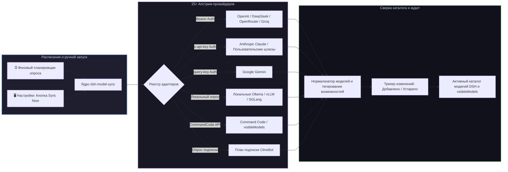

# 📦 @goodandready/dsh-model-sync

<div align="center">

<h3>Динамическая синхронизация каталогов LLM-моделей и автоматический мониторинг баланса для DeepSeek Harness</h3>

<p align="center">
  <a href="https://www.npmjs.com/package/@goodandready/dsh-model-sync"></a>
  <a href="LICENSE"></a>
  <a href="https://github.com/topics/dsh-plugin"></a>
  <a href="https://nodejs.org"></a>
</p>

<p align="center">
  <a href="https://goodandready.app/"></a>
</p>

<p align="center">
  <a href="README.md"><b>🇬🇧 English</b></a> •
  <a href="README.ru.md"><b>🇷🇺 Русский</b></a> •
  <a href="README.zh.md"><b>🇨🇳 中文说明</b></a>
</p>

<table align="center">
  <tr>
    <td align="center">
      ⭐ <strong>Если вам нравится этот плагин, поставьте ему Star на GitHub</strong> — это покажет мне, что плагин полезен, и добавит мотивации продолжать его развитие.
      <br><br>
      🐛 <strong>Если вы нашли баг или хотите предложить новую функцию</strong>, создайте Issue на GitHub на любом языке — я рассмотрю предложение и реализую полезные улучшения в одной из следующих версий плагина.
    </td>
  </tr>
</table>

</div>

---

## ⚡ Обзор

**`dsh-model-sync`** поддерживает каталог моделей **DeepSeek Harness** в актуальном состоянии с апстрим AI-провайдерами.

Вместо ручного редактирования YAML-файлов при выпуске провайдером новой модели, изменении размера контекста или цен, `dsh-model-sync` автоматически обнаруживает новые релизы, обновляет метаданные возможностей (`vision`, `tools`, `reasoning`, `embeddings`), отслеживает баланс аккаунтов, управляет видимостью моделей в интерфейсе и синхронизирует модели на лету без перезапуска сервера.



---

## ✨ Ключевые возможности

* 🔄 **Автоматическое обнаружение каталога**: синхронизация списков моделей, алиасов, контекстных окон и флагов возможностей (`vision`, `tools`, `reasoning`, `embeddings`) для 25+ провайдеров.
* 🛡️ **Совместимость шаблонов чата и ролей Minijinja**: автоматическая установка `compat.supportsDeveloperRole: false` для открытых моделей Groq (Qwen, Llama, Mistral, Gemma, DeepSeek) и DeepSeek API, предотвращая ошибки 400 `Unexpected message role` для reasoning-моделей с сохранением пользовательских настроек.
* 🌐 **25+ встроенных адаптеров провайдеров**: готовая поддержка OpenAI, Anthropic, Google, DeepSeek, xAI, OpenRouter, Groq, Mistral, Cerebras, Fireworks, HuggingFace, Moonshot, NVIDIA, Qwen, Together, Xiaomi MiMo, SiliconFlow, Command Code, ClineBot и локальной Ollama.
* 🎛️ **Управление моделями Command Code**: полное обнаружение моделей Command Code с возможностью выбора чекбоксами в UI и автоматической синхронизацией `visibleModels` в настройках `llm-commandcode`.
* 🎯 **Синхронизация тарифного плана ClineBot**: выделенный адаптер, опрашивающий `GET /users/me/plan`, который получает исключительно модели, входящие в активную подписку, исключая появление сотен недоступных моделей.
* 🔌 **Поддержка универсальных и кастомных адаптеров**: подключение произвольных OpenAI-совместимых эндпоинтов `/v1/models` с настраиваемой авторизацией (`bearer`, `x-api-key`, `query-key`, `none`).
* 📊 **Мониторинг баланса и квот**: опрос биллинговых эндпоинтов провайдеров (где поддерживается) для предотвращения неожиданного исчерпания средств.
* 📜 **История синхронизации и аудит диффов**: отслеживание всех добавленных моделей, устаревших ID и изменённых возможностей с журналом изменений во времени.
* 🖥️ **Полноценная панель Web UI (**Настройки → Синхронизация моделей**)**:
  * Карточки статуса по каждому провайдеру со счётчиками активных моделей;
  * Кнопка мгновенной синхронизации «Sync Now»;
  * Выбор и скрытие моделей чекбоксами;
  * Переключатели включения/отключения провайдеров и ввод кастомных эндпоинтов.

---

## 🛠️ Поддерживаемые провайдеры

| Идентификатор провайдера | Формат авторизации | Автоопределение возможностей и примечания |
|---|---|---|
| `openai` | Bearer Token | `vision`, `tools`, `reasoning`, `embeddings` |
| `anthropic` | Заголовок `x-api-key` | `vision`, `tools`, `reasoning` |
| `google` | Query-параметр / Ключ | `vision`, `tools`, `reasoning`, `embeddings` |
| `deepseek` | Bearer Token | `tools`, `reasoning` |
| `xai` | Bearer Token | `vision`, `tools`, `reasoning` |
| `openrouter` | Bearer Token | Мультипровайдерный каталог с ценами и контекстными лимитами |
| `groq` | Bearer Token | `tools`, `reasoning`, `vision`, `supportsDeveloperRole: false` |
| `mistral` | Bearer Token | `tools`, `reasoning`, `vision` |
| `commandcode` | Bearer Token | Каталог `https://api.commandcode.ai/provider/v1/models` с сохранением выбора в `visibleModels` для `llm-commandcode` |
| `clinebot` | Bearer Token | Опрос активного тарифного плана (`/users/me/plan`), синхронизация строго включённых в подписку моделей |
| `fireworks` | Bearer Token | Эндпоинты открытых весов |
| `huggingface` | Bearer Token | Каталог Serverless Inference API |
| `together` | Bearer Token | Каталог моделей Open-Source |
| `ollama` | Локальный HTTP (`none`) | Локальное обнаружение офлайн-моделей (`/api/tags`) |
| `custom` | Настраиваемый | Любой кастомный шлюз, совместимый с OpenAI или Google |

---

## 📦 Быстрая установка

```bash
dsh plugin --profile web add @goodandready/dsh-model-sync
```

> [!IMPORTANT]
> Перезапустите Web UI DSH после установки (`systemctl --user restart dsh-web`), чтобы активировать фоновую синхронизацию каталогов.

---

## ⚙️ Конфигурация (`settings.yaml`)

```yaml
dsh-model-sync:
  enabled: true
  syncIntervalMinutes: 60
  autoReconcile: true
  enableBalanceChecks: true
  providers:
    commandcode:
      enabled: true
    clinebot:
      enabled: true
```

| Параметр | Тип | По умолчанию | Описание |
|---|---|---|---|
| `enabled` | `boolean` | `true` | Главный переключатель фоновой синхронизации |
| `syncIntervalMinutes` | `number` | `60` | Периодичность опроса провайдеров (в минутах) |
| `autoReconcile` | `boolean` | `true` | Автоматически применять обнаруженные модели к активному каталогу |
| `enableBalanceChecks` | `boolean` | `true` | Опрашивать биллинговые эндпоинты при наличии поддержки |
| `providers.<id>.enabled`| `boolean` | `true` | Включение или отключение обнаружения для конкретного провайдера |

---

## 📄 Лицензия

MIT © [GooDAnDReaDY](https://github.com/GooDAnDReaDY)
