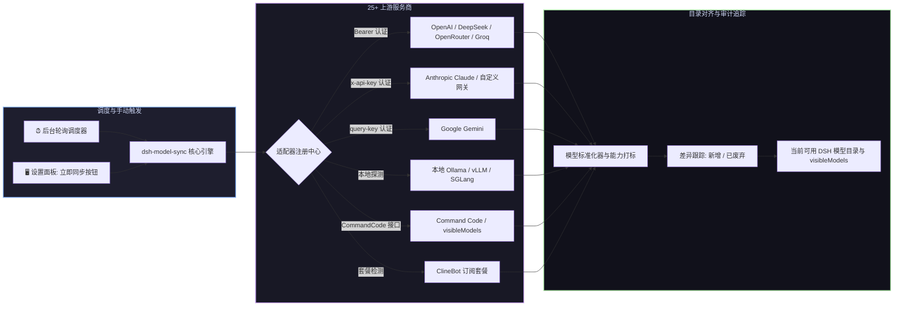

# 📦 @goodandready/dsh-model-sync

<div align="center">

<h3>面向 DeepSeek Harness 的动态大模型目录同步与自动化余额监控插件</h3>

<p align="center">
  <a href="https://www.npmjs.com/package/@goodandready/dsh-model-sync"></a>
  <a href="LICENSE"></a>
  <a href="https://github.com/topics/dsh-plugin"></a>
  <a href="https://nodejs.org"></a>
</p>

<p align="center">
  <a href="https://goodandready.app/"></a>
</p>

<p align="center">
  <a href="README.md"><b>🇬🇧 English</b></a> •
  <a href="README.ru.md"><b>🇷🇺 Русский</b></a> •
  <a href="README.zh.md"><b>🇨🇳 中文说明</b></a>
</p>

<table align="center">
  <tr>
    <td align="center">
      ⭐ <strong>如果您喜欢这个插件，请在 GitHub 上为它点亮 Star</strong> — 这能让我知道插件对您有用，并鼓励我继续开发和维护它。
      <br><br>
      🐛 <strong>如果您发现 Bug 或希望增加功能</strong>，请使用任意语言在 GitHub 上提交 Issue — 我会评估您的建议，并在后续版本中实现有价值的改进。
    </td>
  </tr>
</table>

</div>

---

## ⚡ 插件概览

**`dsh-model-sync`** 保持您的 **DeepSeek Harness** 模型目录与上游各大 AI 服务商最新发布完全同步。

每当服务商推出新模型、调整上下文窗口上限或变更费率时，不再需要手动逐项编辑 YAML 配置文件。`dsh-model-sync` 能够自动发现新版本、更新模型能力元数据（`vision`、`tools`、`reasoning`、`embeddings`）、监控账户余额并在无需重启服务的情况下即时对齐模型目录。



---

## ✨ 核心特性

* 🔄 **自动化目录同步**：自动对齐 25+ 服务商的模型清单、别名、上下文窗口及能力标签（`vision`、`tools`、`reasoning`、`embeddings`）。
* 🛡️ **Minijinja 聊天模板与角色兼容性保障**：自动为 Groq 开源模型（Qwen、Llama、Mistral、Gemma、DeepSeek）及 DeepSeek API 注入 `compat.supportsDeveloperRole: false`，避免推理模型报 400 `Unexpected message role` 错误，同时保留用户自定义配置。
* 🌐 **内置 25+ 服务商适配器**：预置支持 OpenAI、Anthropic、Google、DeepSeek、xAI、OpenRouter、Groq、Mistral、Cerebras、Fireworks、HuggingFace、Moonshot、NVIDIA、Qwen、Together、Xiaomi MiMo、SiliconFlow、Command Code、ClineBot 以及本地 Ollama。
* 🎛️ **Command Code 模型精细管理**：完整发现 Command Code 模型目录，在 Web 界面提供勾选过滤，自动同步 `visibleModels` 至 `llm-commandcode` 设置中。
* 🎯 **ClineBot 订阅套餐精准匹配**：专属适配器直接调用 `GET /users/me/plan`，只拉取当前有效订阅套餐包含的模型，彻底解决全量拉取 400+ 外部模型导致的混淆。
* 🔌 **通用与自定义适配器扩展**：支持接入任意兼容 OpenAI `/v1/models` 规范的网关，支持多种认证方式（`bearer`、`x-api-key`、`query-key`、`none`）。
* 📊 **余额与用量监控**：实时查询上游计费端点，精准反馈账户额度并防止因欠费导致任务中断。
* 📜 **同步历史与变更审计**：完整记录新模型上线、旧模型废弃及能力变更的时间线与详细差异。
* 🖥️ **全功能 Web 管理面板 (**设置 → 模型同步**)**：
  * 每个服务商的卡片化状态展示与模型计数；
  * 一键即时同步（Sync Now）；
  * 模型勾选过滤与显示控制；
  * 服务商启用开关及自定义 Endpoint 地址输入。

---

## 🛠️ 支持的服务商列表

| 服务商标识符 | 认证机制 | 能力自检与特性说明 |
|---|---|---|
| `openai` | Bearer Token | `vision`, `tools`, `reasoning`, `embeddings` |
| `anthropic` | `x-api-key` 请求头 | `vision`, `tools`, `reasoning` |
| `google` | Query 参数 / 密钥 | `vision`, `tools`, `reasoning`, `embeddings` |
| `deepseek` | Bearer Token | `tools`, `reasoning` |
| `xai` | Bearer Token | `vision`, `tools`, `reasoning` |
| `openrouter` | Bearer Token | 多厂商汇聚模型目录，包含计费与上下文规格 |
| `groq` | Bearer Token | `tools`, `reasoning`, `vision`, `supportsDeveloperRole: false` |
| `mistral` | Bearer Token | `tools`, `reasoning`, `vision` |
| `commandcode` | Bearer Token | 对接 `https://api.commandcode.ai/provider/v1/models`，同步勾选至 `llm-commandcode` 的 `visibleModels` |
| `clinebot` | Bearer Token | 仅同步有效订阅套餐 (`/users/me/plan`) 包含的模型 |
| `fireworks` | Bearer Token | 开源权重推理节点 |
| `huggingface` | Bearer Token | Serverless Inference API 目录 |
| `together` | Bearer Token | 开源大模型服务网络 |
| `ollama` | 本地 HTTP (`none`) | 本地离线模型实时发现 (`/api/tags`) |
| `custom` | 自定义配置 | 任意兼容 OpenAI 或 Google 规范的 API 网关 |

---

## 📦 快速安装

```bash
dsh plugin --profile web add @goodandready/dsh-model-sync
```

> [!IMPORTANT]
> 安装后请重启 DSH Web 界面 (`systemctl --user restart dsh-web`)，以激活后台目录自动同步。

---

## ⚙️ 配置说明 (`settings.yaml`)

```yaml
dsh-model-sync:
  enabled: true
  syncIntervalMinutes: 60
  autoReconcile: true
  enableBalanceChecks: true
  providers:
    commandcode:
      enabled: true
    clinebot:
      enabled: true
```

| 参数名称 | 类型 | 默认值 | 功能说明 |
|---|---|---|---|
| `enabled` | `boolean` | `true` | 后台自动同步主开关 |
| `syncIntervalMinutes` | `number` | `60` | 目录更新轮询间隔（分钟） |
| `autoReconcile` | `boolean` | `true` | 是否自动将新发现的模型生效至可用列表 |
| `enableBalanceChecks` | `boolean` | `true` | 在受支持的服务商处查询余额 |
| `providers.<id>.enabled`| `boolean` | `true` | 单独开启或关闭指定服务商的同步 |

---

## 📄 开源协议

MIT © [GooDAnDReaDY](https://github.com/GooDAnDReaDY)
