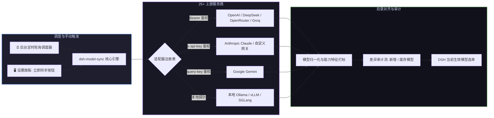

# 📦 @goodandready/dsh-model-sync

<div align="center">

<h3>DeepSeek Harness 服务商模型目录动态同步与账户余额监控插件</h3>

<p align="center">
  <a href="https://www.npmjs.com/package/@goodandready/dsh-model-sync"></a>
  <a href="LICENSE"></a>
  <a href="https://github.com/topics/dsh-plugin"></a>
  <a href="https://nodejs.org"></a>
</p>

<p align="center">
  <a href="https://goodandready.app/"></a>
</p>

<p align="center">
  <a href="README.md"><b>🇬🇧 English</b></a> •
  <a href="README.ru.md"><b>🇷🇺 Русский</b></a> •
  <a href="README.zh.md"><b>🇨🇳 中文说明</b></a>
</p>

<table align="center">
  <tr>
    <td align="center">
      ⭐ <strong>如果您喜欢这个插件，请在 GitHub 上为它点亮 Star</strong> — 这能让我知道插件对您有用，并鼓励我继续开发和维护它。
      <br><br>
      🐛 <strong>如果您发现 Bug 或希望增加功能</strong>，请使用任意语言在 GitHub 上提交 Issue — 我会评估您的建议，并在后续版本中实现有价值的改进。
    </td>
  </tr>
</table>

</div>

---

## 🚀 v0.3.13 性能与质量优化

* ⚡ **ETag / 304 Not Modified 状态缓存**:
  * 为 `GET /dsh-model-sync/status` 提供弱 ETag 支持。UI 定时 15 秒轮询时直接返回 `304 Not Modified`，避免多余 JSON 序列化与流量损耗。
* 🌐 **上游条件请求 (Upstream Conditional Requests)**:
  * 向提供商 API 发送 `If-None-Match` / `If-Modified-Since`。当提供商返回 304 时直接命中缓存，无需重复解析。
* 🎯 **模型搜索防抖与 useMemo 优化**:
  * 模型选择器搜索框加入 150ms debounce 与 `React.useMemo` 缓存，大幅提升大模型列表下的筛选与排序流畅度。
* 🧠 **扩展模型能力检测**:
  * 支持现代推理/思考模型（DeepSeek-R1、o1/o3-mini）及代码专用模型（`code`）的能力标记与策略过滤。
* 🛡️ **带抖动的指数退避重试 (Exponential Jitter)**:
  * 在 API 失败重试时加入随机抖动系数，有效防止高并发下的惊群效应。

---

## ⚡ 插件概览

**`dsh-model-sync`** 保持 **DeepSeek Harness** 模型选单与上游大模型服务商实时同步。

每当服务商上线新模型、扩充上下文长度或调整定价时，插件自动拉取最新清单，同步模型能力标签（`vision` 视觉、`tools` 工具调用、`reasoning` 深度思考、`embeddings` 嵌入），并在无需重启服务的前提下热重载目录。



---

## 📦 安装指南

```bash
dsh plugin --profile web add @goodandready/dsh-model-sync
```

---

## 🚀 v0.4.0 新特性与增强

- **设置卡片一键更新**: 在 DSH 设置卡片中集成自动版本检查，展示当前与最新版本对比徽标，支持一键安全升级并在更新后提示重启。
- **严格本地环回 (Loopback) 安全保护**: 所有修改状态的 HTTP 路由 (`/apply`, `/policy`, `/clear-cache`, `/updater/update`) 均强制校验本地环回 IP (`127.0.0.1`, `::1`, `::ffff:127.0.0.1`) 及请求来源，杜绝外部恶意调用。
- **100% 原生主题变量适配**: 客户端 UI 全面移除硬编码颜色与 `rgba()` 样式，完全切换至 DSH 官方 CSS 设计令牌 (`--dsw-alias-*`)，无缝适配深色与浅色主题。
- **同步引擎模块化拆分**: 核心同步逻辑已解耦拆分为专项子模块 (`synchronizer-helpers.js`, `synchronizer-transfer.js`, `synchronizer-prober.js`)，大幅提升代码可读性与维护性。
- **轻量分发包清理**: 彻底排除内部计划与调试文件，精简 npm 发布体积至 70 KiB 以下，所有文件均完全符合 256 KiB 上限规范。

## 🚀 v0.3.14 新特性与增强

- **语言标准**: 插件原生支持 `en` 与 `zh` 双语，俄语本地化已独立解耦至 `goodandready/dsh-russian-lang` 翻译包 (#191)。
- **发布隔离**: 通过 `.npmignore` 严格过滤测试、规划和文档文件，保证 npm 发布包体积小于 256 KiB。
- **模型批量可用性测试**: 支持通过 `POST /dsh-model-sync/batch-try` 并发批量测试所选模型，展示延迟徽标并一键取消选中不可用模型。
- **价格与上下文窗口过滤**: 支持按每百万 Token 最高价格及最小上下文长度过滤候选模型。
- **配置导入与导出**: 支持通过 `GET /export` 与 `POST /import` 导出及恢复全部策略、模型选择、别名和定时计划。
- **自定义模型别名映射**: 支持通过 `GET/POST /aliases` 为特定服务商与模型组合设置便于调用的简短别名。

## 📄 开源协议

MIT © [GooDAnDReaDY](https://github.com/GooDAnDReaDY)
